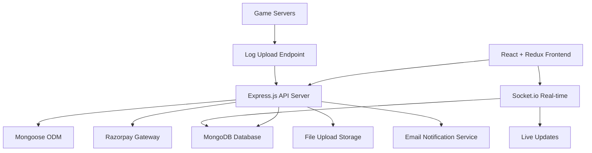

# Design Document

## Overview

The Colab Esports Platform is designed as a microservices-based architecture supporting high-concurrency tournament operations, real-time leaderboard updates, and secure financial transactions. The system integrates multiple gaming platforms (BGMI, Valorant, CS2) with automated match processing, comprehensive user management, and robust payment systems tailored for the Indian esports market.

## Architecture

### System Architecture Pattern
- **Frontend**: React.js SPA with Redux Toolkit for state management and TailwindCSS for styling
- **Backend**: Node.js with Express.js for RESTful APIs and real-time features
- **Database**: MongoDB with Mongoose ODM for flexible document storage
- **State Management**: Redux Toolkit with RTK Query for efficient data fetching
- **File Storage**: Basic cloud storage for screenshots, logs, and user avatars
- **Real-time Communication**: Socket.io for live leaderboard updates
- **Payment Processing**: Razorpay integration for MVP (expandable to multiple gateways)

### High-Level System Flow



## Components and Interfaces

### 1. User Authentication & Profile Management

**Backend Components:**
- `authController.js` (Express): Handles registration, login, KYC verification
- `authMiddleware.js` (Express): JWT token validation and session management
- `User.js` (Mongoose Model): User schema with KYC fields

**Frontend Components:**
- `authSlice.js` (Redux): Authentication state management
- `LoginForm.jsx` (React): User login interface
- `RegisterForm.jsx` (React): User registration with OTP verification
- `ProfilePage.jsx` (React): Profile management and game ID linking

**Key API Endpoints:**
```javascript
// Authentication Routes
POST /api/auth/register
POST /api/auth/login
POST /api/auth/verify-otp
GET /api/auth/profile
PUT /api/auth/profile
POST /api/auth/link-game-account
```

### 2. Tournament Management System

**Backend Components:**
- `tournamentController.js` (Express): CRUD operations for tournaments
- `Tournament.js` (Mongoose Model): Tournament schema with all fields
- `tournamentService.js` (Node.js): Business logic for tournament lifecycle

**Frontend Components:**
- `tournamentSlice.js` (Redux): Tournament state management
- `TournamentList.jsx` (React): Tournament listing with filters
- `TournamentDetails.jsx` (React): Tournament details and joining flow
- `TournamentCard.jsx` (React): Individual tournament display component

**Key API Endpoints:**
```javascript
// Tournament Routes
GET /api/tournaments
GET /api/tournaments/:id
POST /api/tournaments
PUT /api/tournaments/:id
POST /api/tournaments/:id/join
GET /api/tournaments/:id/participants
```

### 3. Match Flow & Result Processing

**Backend Components:**
- `matchController.js` (Express): Match CRUD and result submission
- `Match.js` (Mongoose Model): Match schema with room credentials
- `roomGenerator.js` (Node.js): Dynamic room credential generation
- `fileUpload.js` (Multer): Screenshot and log file handling

**Frontend Components:**
- `matchSlice.js` (Redux): Match state management
- `MatchRoom.jsx` (React): Match room display with credentials
- `ResultSubmission.jsx` (React): Result submission form
- `MatchHistory.jsx` (React): User's match history

**Key API Endpoints:**
```javascript
// Match Routes
GET /api/matches/user/:userId
GET /api/matches/:id
POST /api/matches/:id/submit-result
POST /api/matches/:id/upload-screenshot
PUT /api/matches/:id/room-credentials
```

### 4. Leaderboard Engine

**Backend Components:**
- `leaderboardController.js` (Express): Leaderboard CRUD operations
- `Leaderboard.js` (Mongoose Model): Leaderboard schema with indexing
- `scoreCalculator.js` (Node.js): Score calculation service
- `leaderboardSocket.js` (Socket.io): Real-time leaderboard updates

**Frontend Components:**
- `leaderboardSlice.js` (Redux): Leaderboard state management
- `LeaderboardTable.jsx` (React): Leaderboard display component
- `LiveLeaderboard.jsx` (React): Real-time leaderboard with Socket.io
- `PlayerStats.jsx` (React): Individual player statistics

**Scoring Algorithm:**
```javascript
class ScoreCalculator {
    static calculateScore(stats) {
        return (stats.kills * 100) + 
               (stats.assists * 50) - 
               (stats.deaths * 20) + 
               (stats.winBonus || 0);
    }
    
    static aggregateTournamentScore(userId, tournamentId) {
        // Sum all match scores for user in tournament
    }
}
```

### 5. Wallet & Payment System

**Backend Components:**
- `walletController.js` (Express): Balance management and transactions
- `Wallet.js` (Mongoose Model): Wallet schema with balance tracking
- `Transaction.js` (Mongoose Model): Transaction history schema
- `razorpayService.js` (Node.js): Razorpay payment integration

**Frontend Components:**
- `walletSlice.js` (Redux): Wallet state management
- `WalletDashboard.jsx` (React): Wallet balance and transaction history
- `AddMoney.jsx` (React): Money addition interface
- `WithdrawMoney.jsx` (React): Withdrawal request interface

**Key API Endpoints:**
```javascript
// Wallet Routes
GET /api/wallet/balance
POST /api/wallet/add-money
POST /api/wallet/withdraw
GET /api/wallet/transactions
POST /api/wallet/process-payment
```

### 6. Admin Dashboard

**Backend Components:**
- `adminController.js` (Express): Administrative operations
- `adminMiddleware.js` (Express): Role-based access control
- `adminService.js` (Node.js): Admin-specific business logic

**Frontend Components:**
- `adminSlice.js` (Redux): Admin state management
- `AdminDashboard.jsx` (React): Main admin interface
- `TournamentManagement.jsx` (React): Tournament admin tools
- `UserManagement.jsx` (React): User administration interface

### 7. Security & Fair Play

**Backend Components:**
- `securityService.js` (Node.js): Security checks and validations
- `logParser.js` (Node.js): Server log analysis
- `duplicateDetector.js` (Node.js): IP/device detection
- `flaggingSystem.js` (Node.js): Account flagging logic

**Frontend Components:**
- `SecurityReports.jsx` (React): Admin security dashboard
- `FlaggedAccounts.jsx` (React): Flagged account management
- `VerificationQueue.jsx` (React): Manual verification interface

### 8. Engagement & Notification System

**Backend Components:**
- `notificationController.js` (Express): Notification management
- `Notification.js` (Mongoose Model): Notification schema
- `emailService.js` (Node.js): Email notification service
- `engagementTracker.js` (Node.js): Streak and achievement tracking

**Frontend Components:**
- `notificationSlice.js` (Redux): Notification state management
- `NotificationCenter.jsx` (React): Notification display
- `AchievementBadges.jsx` (React): Achievement and badge system
- `ReferralSystem.jsx` (React): Referral program interface

## Data Models

### MongoDB Schemas with Mongoose

**User Schema:**
```javascript
const userSchema = new mongoose.Schema({
    username: { type: String, required: true, unique: true },
    email: { type: String, required: true, unique: true },
    phone: { type: String, required: true, unique: true },
    passwordHash: { type: String, required: true },
    avatarUrl: { type: String, default: '' },
    kycStatus: { 
        type: String, 
        enum: ['pending', 'verified', 'rejected'], 
        default: 'pending' 
    },
    panCard: { type: String, default: '' },
    gameIds: {
        steam: { type: String, default: '' },
        bgmi: { type: String, default: '' },
        valorant: { type: String, default: '' }
    },
    role: { type: String, enum: ['user', 'admin'], default: 'user' },
    isActive: { type: Boolean, default: true },
    loginStreak: { type: Number, default: 0 },
    lastLogin: { type: Date, default: Date.now }
}, { timestamps: true });
```

**Tournament Schema:**
```javascript
const tournamentSchema = new mongoose.Schema({
    name: { type: String, required: true },
    gameType: { 
        type: String, 
        enum: ['bgmi', 'valorant', 'cs2'], 
        required: true 
    },
    entryFee: { type: Number, required: true },
    prizePool: { type: Number, required: true },
    maxParticipants: { type: Number, required: true },
    currentParticipants: { type: Number, default: 0 },
    startDate: { type: Date, required: true },
    endDate: { type: Date, required: true },
    status: { 
        type: String, 
        enum: ['upcoming', 'active', 'completed', 'cancelled'], 
        default: 'upcoming' 
    },
    rules: { type: String, required: true },
    participants: [{ 
        type: mongoose.Schema.Types.ObjectId, 
        ref: 'User' 
    }],
    createdBy: { 
        type: mongoose.Schema.Types.ObjectId, 
        ref: 'User', 
        required: true 
    }
}, { timestamps: true });
```

**Match Schema:**
```javascript
const matchSchema = new mongoose.Schema({
    tournamentId: { 
        type: mongoose.Schema.Types.ObjectId, 
        ref: 'Tournament', 
        required: true 
    },
    roundNumber: { type: Number, required: true },
    roomId: { type: String, default: '' },
    roomPassword: { type: String, default: '' },
    scheduledAt: { type: Date, required: true },
    status: { 
        type: String, 
        enum: ['scheduled', 'active', 'completed', 'disputed'], 
        default: 'scheduled' 
    },
    participants: [{
        userId: { type: mongoose.Schema.Types.ObjectId, ref: 'User' },
        kills: { type: Number, default: 0 },
        deaths: { type: Number, default: 0 },
        assists: { type: Number, default: 0 },
        finalPosition: { type: Number, default: 0 },
        score: { type: Number, default: 0 },
        screenshotUrl: { type: String, default: '' }
    }],
    serverLogUrl: { type: String, default: '' },
    disputeReason: { type: String, default: '' },
    isDisputed: { type: Boolean, default: false }
}, { timestamps: true });
```

**Leaderboard Schema:**
```javascript
const leaderboardSchema = new mongoose.Schema({
    userId: { 
        type: mongoose.Schema.Types.ObjectId, 
        ref: 'User', 
        required: true 
    },
    tournamentId: { 
        type: mongoose.Schema.Types.ObjectId, 
        ref: 'Tournament' 
    },
    matchId: { 
        type: mongoose.Schema.Types.ObjectId, 
        ref: 'Match' 
    },
    kills: { type: Number, default: 0 },
    deaths: { type: Number, default: 0 },
    assists: { type: Number, default: 0 },
    score: { type: Number, required: true },
    rankPosition: { type: Number, default: 0 },
    leaderboardType: { 
        type: String, 
        enum: ['match', 'tournament', 'seasonal'], 
        required: true 
    },
    gameType: { 
        type: String, 
        enum: ['bgmi', 'valorant', 'cs2'], 
        required: true 
    }
}, { timestamps: true });

// Index for efficient leaderboard queries
leaderboardSchema.index({ leaderboardType: 1, score: -1 });
leaderboardSchema.index({ tournamentId: 1, score: -1 });
```

**Wallet Schema:**
```javascript
const walletSchema = new mongoose.Schema({
    userId: { 
        type: mongoose.Schema.Types.ObjectId, 
        ref: 'User', 
        required: true, 
        unique: true 
    },
    balance: { type: Number, default: 0.00 },
    totalDeposited: { type: Number, default: 0.00 },
    totalWithdrawn: { type: Number, default: 0.00 },
    totalWinnings: { type: Number, default: 0.00 },
    isBlocked: { type: Boolean, default: false }
}, { timestamps: true });
```

**Transaction Schema:**
```javascript
const transactionSchema = new mongoose.Schema({
    userId: { 
        type: mongoose.Schema.Types.ObjectId, 
        ref: 'User', 
        required: true 
    },
    type: { 
        type: String, 
        enum: ['deposit', 'withdrawal', 'entry_fee', 'prize_won', 'refund'], 
        required: true 
    },
    amount: { type: Number, required: true },
    status: { 
        type: String, 
        enum: ['pending', 'completed', 'failed', 'cancelled'], 
        default: 'pending' 
    },
    paymentGateway: { type: String, default: 'razorpay' },
    gatewayTransactionId: { type: String, default: '' },
    description: { type: String, required: true },
    tournamentId: { 
        type: mongoose.Schema.Types.ObjectId, 
        ref: 'Tournament' 
    },
    balanceAfter: { type: Number, required: true }
}, { timestamps: true });
```

## Error Handling

### Error Response Format
```json
{
    "success": false,
    "error": {
        "code": "INSUFFICIENT_BALANCE",
        "message": "Wallet balance insufficient for tournament entry",
        "details": {
            "required": 500.00,
            "available": 250.00
        }
    },
    "timestamp": "2024-10-24T10:30:00Z"
}
```

### Critical Error Scenarios
1. **Payment Failures**: Automatic rollback of wallet deductions
2. **Match Disputes**: Queue for manual admin review
3. **Server Log Corruption**: Fallback to screenshot verification
4. **Leaderboard Calculation Errors**: Retry mechanism with exponential backoff
5. **KYC Verification Failures**: User notification with retry instructions

## Testing Strategy

### Unit Testing
- **Backend**: Jest for Node.js/Express controllers and services
- **Frontend**: React Testing Library for component testing
- **Redux**: Redux Toolkit testing utilities for state management

### Integration Testing
- **API Testing**: Supertest for Express.js endpoint validation
- **Database**: MongoDB Memory Server for isolated testing
- **Payment Gateway**: Razorpay sandbox environment testing

### Performance Testing
- **Load Testing**: Artillery.js for concurrent user simulation
- **Database**: MongoDB query optimization with proper indexing
- **Frontend**: Lighthouse for performance auditing

### Security Testing
- **Authentication**: JWT token validation and expiration testing
- **Input Validation**: Mongoose schema validation and sanitization
- **Payment Security**: Razorpay webhook signature verification

### Automated Testing Pipeline
- **Pre-commit**: ESLint, Prettier, and unit tests
- **CI/CD**: GitHub Actions for automated testing on pull requests
- **Staging**: Full integration testing before production deployment

## User Interface Design

### Design System & Visual Identity

**Color Palette:**
- **Primary**: Gaming-focused dark theme with neon accents
- **Background**: Dark navy (#0F172A) and charcoal (#1E293B)
- **Accent Colors**: Electric blue (#3B82F6), neon green (#10B981), warning orange (#F59E0B)
- **Text**: White (#FFFFFF) for primary, light gray (#E2E8F0) for secondary
- **Success**: Green (#22C55E), Error: Red (#EF4444)

**Typography:**
- **Headers**: Inter/Poppins - Bold, modern gaming aesthetic
- **Body**: Inter - Clean, readable for long tournament descriptions
- **Gaming Elements**: Orbitron/Rajdhani for scores and stats (futuristic feel)

**Visual Style:**
- **Gaming-first aesthetic** with subtle gradients and glowing effects
- **Card-based layout** with rounded corners and subtle shadows
- **Neon accent borders** for active states and highlights
- **Glassmorphism effects** for overlays and modals

### Layout Structure

**Navigation:**
```
[Logo] [Tournaments] [Leaderboards] [Wallet] [Profile] [Notifications] [Avatar▼]
```
- **Sticky header** with quick access to all major sections
- **Mobile**: Hamburger menu with slide-out navigation
- **Wallet balance** prominently displayed in header
- **Notification bell** with red dot for unread notifications

**Dashboard Layout:**
```
┌─────────────────────────────────────────────────────────────┐
│ Header Navigation                                           │
├─────────────────────────────────────────────────────────────┤
│ Hero Section: "Welcome back, [Username]"                   │
│ Quick Stats: Tournaments Won | Current Rank | Wallet       │
├─────────────────────────────────────────────────────────────┤
│ ┌─────────────────┐ ┌─────────────────┐ ┌─────────────────┐ │
│ │ Active          │ │ Upcoming        │ │ Recent          │ │
│ │ Tournaments     │ │ Tournaments     │ │ Results         │ │
│ │                 │ │                 │ │                 │ │
│ └─────────────────┘ └─────────────────┘ └─────────────────┘ │
├─────────────────────────────────────────────────────────────┤
│ Live Leaderboard Preview                                    │
└─────────────────────────────────────────────────────────────┘
```

### Page-by-Page UI Design

#### 1. Tournament Listing Page
**Layout:**
- **Filter sidebar** (left): Game type, entry fee range, prize pool, status
- **Tournament grid** (main): Card-based layout with key information
- **Search bar** at top with real-time filtering

**Tournament Card Design:**
```
┌─────────────────────────────────────────────────────────┐
│ [Game Icon] BGMI Solo Championship        [LIVE/UPCOMING]│
│                                                         │
│ 🏆 Prize Pool: ₹50,000    👥 Players: 45/100          │
│ 💰 Entry Fee: ₹500        ⏰ Starts: 2 hours          │
│                                                         │
│ [Join Tournament] [View Details]                        │
└─────────────────────────────────────────────────────────┘
```

#### 2. Tournament Details Page
**Hero Section:**
- **Large banner** with game artwork background
- **Tournament title** and status badge
- **Key stats** in prominent cards (prize pool, participants, entry fee)

**Tabbed Content:**
- **Overview**: Rules, format, schedule
- **Participants**: List of registered players
- **Brackets**: Tournament bracket visualization (for elimination format)
- **Leaderboard**: Live rankings during tournament

**Join Tournament Flow:**
```
┌─────────────────────────────────────────────────────────┐
│ Tournament: BGMI Solo Championship                      │
│ Entry Fee: ₹500                                         │
│ Your Wallet Balance: ₹1,250                            │
│                                                         │
│ ✓ Sufficient balance available                          │
│                                                         │
│ [Confirm & Join Tournament]                             │
└─────────────────────────────────────────────────────────┘
```

#### 3. Match Interface
**Pre-Match:**
```
┌─────────────────────────────────────────────────────────┐
│ Match #3 - Round 2                                      │
│ BGMI Solo Championship                                  │
│                                                         │
│ 🎮 Room ID: 123456789                                  │
│ 🔐 Password: MATCH123                                   │
│                                                         │
│ ⏰ Match starts in: 05:23                              │
│                                                         │
│ [Copy Room Details] [Join Game]                         │
└─────────────────────────────────────────────────────────┘
```

**Post-Match Result Submission:**
```
┌─────────────────────────────────────────────────────────┐
│ Submit Match Results                                    │
│                                                         │
│ Your Performance:                                       │
│ Kills: [___] Assists: [___] Deaths: [___]              │
│ Final Position: [Dropdown: 1st, 2nd, 3rd...]          │
│                                                         │
│ Screenshot Upload:                                      │
│ [Drag & Drop or Click to Upload]                       │
│                                                         │
│ [Submit Results]                                        │
└─────────────────────────────────────────────────────────┘
```

#### 4. Leaderboard Interface
**Tournament Leaderboard:**
```
┌─────────────────────────────────────────────────────────┐
│ 🏆 BGMI Solo Championship - Leaderboard                │
│                                                         │
│ Rank | Player      | Kills | Deaths | Score | Prize    │
│ ─────┼─────────────┼───────┼────────┼───────┼──────────│
│  🥇1 | ProGamer123 |   15  |    3   | 1,440 | ₹25,000 │
│  🥈2 | SnipeKing   |   12  |    5   | 1,100 | ₹15,000 │
│  🥉3 | RushMaster  |   10  |    4   |   920 | ₹10,000 │
│   4  | You         |    8  |    6   |   680 |    -     │
└─────────────────────────────────────────────────────────┘
```

#### 5. Wallet Interface
**Wallet Dashboard:**
```
┌─────────────────────────────────────────────────────────┐
│ 💰 Wallet Balance: ₹2,450.00                          │
│                                                         │
│ ┌─────────────────┐ ┌─────────────────┐               │
│ │ [+ Add Money]   │ │ [💸 Withdraw]   │               │
│ └─────────────────┘ └─────────────────┘               │
│                                                         │
│ Recent Transactions:                                    │
│ ┌─────────────────────────────────────────────────────┐ │
│ │ ✅ Prize Won - BGMI Championship    +₹5,000        │ │
│ │ ❌ Entry Fee - Valorant Tournament  -₹300          │ │
│ │ ✅ Money Added - Razorpay          +₹1,000         │ │
│ └─────────────────────────────────────────────────────┘ │
└─────────────────────────────────────────────────────────┘
```

#### 6. Profile & Settings
**Profile Overview:**
```
┌─────────────────────────────────────────────────────────┐
│ [Avatar] ProGamer123                                    │
│          Level 15 🏆                                    │
│                                                         │
│ Game IDs:                                               │
│ 🎮 BGMI: ProGamer#123                                  │
│ 🎯 Valorant: ProGamer#TAG                              │
│ ⚡ Steam: ProGamer123                                   │
│                                                         │
│ Stats:                                                  │
│ Tournaments Won: 5 | Total Earnings: ₹15,000          │
│ Win Rate: 65% | Current Streak: 3                      │
└─────────────────────────────────────────────────────────┘
```

### Mobile-First Responsive Design

**Mobile Layout Priorities:**
1. **Bottom navigation** for main sections (tournaments, leaderboard, wallet, profile)
2. **Swipeable cards** for tournament browsing
3. **Collapsible filters** with slide-up modal
4. **Touch-optimized buttons** with proper spacing
5. **Simplified match interface** with large, tappable elements

**Breakpoints:**
- **Mobile**: 320px - 768px (single column, bottom nav)
- **Tablet**: 768px - 1024px (two-column layout)
- **Desktop**: 1024px+ (full sidebar and multi-column layout)

### Interactive Elements & Animations

**Micro-interactions:**
- **Button hover effects** with subtle glow and scale
- **Card hover** with lift effect and border glow
- **Loading states** with skeleton screens and gaming-themed spinners
- **Success animations** with confetti for tournament wins
- **Real-time updates** with smooth fade-in animations

**Gaming-Specific UI Elements:**
- **Kill/Death counters** with animated number changes
- **Progress bars** for tournament completion
- **Rank badges** with metallic effects (Bronze, Silver, Gold, Diamond)
- **Achievement popups** with celebration animations
- **Live indicators** with pulsing effects for active matches

### Redux State Management Architecture

**Store Structure:**
```javascript
// store/index.js
const store = configureStore({
    reducer: {
        auth: authSlice.reducer,
        tournaments: tournamentSlice.reducer,
        matches: matchSlice.reducer,
        leaderboard: leaderboardSlice.reducer,
        wallet: walletSlice.reducer,
        notifications: notificationSlice.reducer,
        admin: adminSlice.reducer
    },
    middleware: (getDefaultMiddleware) =>
        getDefaultMiddleware().concat(apiSlice.middleware)
});
```

**RTK Query API Slice:**
```javascript
// api/apiSlice.js
export const apiSlice = createApi({
    reducerPath: 'api',
    baseQuery: fetchBaseQuery({
        baseUrl: '/api',
        prepareHeaders: (headers, { getState }) => {
            const token = getState().auth.token;
            if (token) {
                headers.set('authorization', `Bearer ${token}`);
            }
            return headers;
        }
    }),
    tagTypes: ['User', 'Tournament', 'Match', 'Leaderboard', 'Wallet'],
    endpoints: (builder) => ({
        // API endpoints defined here
    })
});
```

### TailwindCSS Design System

**Custom Configuration:**
```javascript
// tailwind.config.js
module.exports = {
    content: ['./src/**/*.{js,jsx,ts,tsx}'],
    theme: {
        extend: {
            colors: {
                primary: {
                    50: '#eff6ff',
                    500: '#3b82f6',
                    900: '#1e3a8a'
                },
                gaming: {
                    dark: '#0f172a',
                    charcoal: '#1e293b',
                    neon: '#10b981',
                    accent: '#f59e0b'
                }
            },
            fontFamily: {
                'gaming': ['Orbitron', 'monospace'],
                'body': ['Inter', 'sans-serif']
            },
            animation: {
                'glow': 'glow 2s ease-in-out infinite alternate',
                'pulse-slow': 'pulse 3s cubic-bezier(0.4, 0, 0.6, 1) infinite'
            }
        }
    },
    plugins: [
        require('@tailwindcss/forms'),
        require('@tailwindcss/typography')
    ]
};
```

**Component Classes:**
```css
/* Custom gaming-themed classes */
.card-gaming {
    @apply bg-gaming-charcoal border border-gray-700 rounded-lg shadow-lg hover:shadow-xl transition-all duration-300;
}

.btn-primary {
    @apply bg-primary-500 hover:bg-primary-600 text-white font-semibold py-2 px-4 rounded-lg transition-colors duration-200;
}

.btn-gaming {
    @apply bg-gradient-to-r from-gaming-neon to-primary-500 hover:from-gaming-neon hover:to-primary-600 text-white font-bold py-3 px-6 rounded-lg shadow-lg hover:shadow-xl transform hover:scale-105 transition-all duration-200;
}

.text-glow {
    @apply text-gaming-neon drop-shadow-[0_0_10px_rgba(16,185,129,0.5)];
}
```

### Accessibility & UX Considerations

**Accessibility:**
- **High contrast** mode for better visibility using TailwindCSS dark mode
- **Keyboard navigation** support for all interactive elements
- **Screen reader** compatibility with proper ARIA labels
- **Font scaling** support using TailwindCSS responsive typography
- **Focus indicators** with custom TailwindCSS focus styles

**UX Enhancements:**
- **Quick actions** - One-click tournament joining with Redux state updates
- **Smart defaults** - Remember user preferences in Redux persist
- **Offline indicators** - Show when features require internet using Redux state
- **Error recovery** - Clear error messages with suggested actions via Redux error handling
- **Loading optimization** - Progressive loading with Redux RTK Query caching
- **Real-time updates** - Socket.io integration with Redux state synchronization

## Security Architecture

### Authentication & Authorization

**JWT Security Implementation:**
```javascript
// Secure JWT handling with httpOnly cookies
const generateTokens = (user) => {
  const accessToken = jwt.sign(
    { userId: user._id, email: user.email, role: user.role },
    process.env.JWT_ACCESS_SECRET,
    { expiresIn: '15m', issuer: 'gaming-platform', audience: 'gaming-users' }
  );
  
  const refreshToken = jwt.sign(
    { userId: user._id },
    process.env.JWT_REFRESH_SECRET,
    { expiresIn: '7d', issuer: 'gaming-platform' }
  );
  
  return { accessToken, refreshToken };
};

// Cookie configuration
const cookieOptions = {
  httpOnly: true,
  secure: process.env.NODE_ENV === 'production',
  sameSite: 'strict',
  maxAge: 7 * 24 * 60 * 60 * 1000 // 7 days
};
```

**Input Validation Schema:**
```javascript
const tournamentValidation = Joi.object({
  name: Joi.string().min(3).max(100).required().trim(),
  description: Joi.string().max(500).optional().trim(),
  gameType: Joi.string().valid('bgmi', 'cs2', 'valorant', 'freefire').required(),
  entryFee: Joi.number().min(0).max(10000).required(),
  prizePool: Joi.number().min(0).required(),
  maxParticipants: Joi.number().min(2).max(1000).required(),
  startDate: Joi.date().min('now').required(),
  endDate: Joi.date().greater(Joi.ref('startDate')).required(),
  rules: Joi.string().min(10).max(2000).required().trim()
});
```

**Rate Limiting Configuration:**
```javascript
const rateLimitConfig = {
  windowMs: 15 * 60 * 1000, // 15 minutes
  max: 100, // limit each IP to 100 requests per windowMs
  message: {
    success: false,
    error: {
      code: 'RATE_LIMIT_EXCEEDED',
      message: 'Too many requests from this IP, please try again later.'
    }
  },
  standardHeaders: true,
  legacyHeaders: false,
  skip: (req) => req.ip === '127.0.0.1' // Skip localhost in development
};
```

### Database Security & Performance

**MongoDB Indexing Strategy:**
```javascript
// User Collection Indexes
db.users.createIndex({ email: 1 }, { unique: true });
db.users.createIndex({ username: 1 }, { unique: true });
db.users.createIndex({ phone: 1 }, { unique: true });
db.users.createIndex({ kycStatus: 1, isActive: 1 });

// Tournament Collection Indexes
db.tournaments.createIndex({ gameType: 1, status: 1 });
db.tournaments.createIndex({ startDate: 1, endDate: 1 });
db.tournaments.createIndex({ entryFee: 1, prizePool: 1 });
db.tournaments.createIndex({ createdAt: -1 });

// Match Collection Indexes
db.matches.createIndex({ tournamentId: 1, roundNumber: 1 });
db.matches.createIndex({ status: 1, scheduledAt: 1 });
db.matches.createIndex({ 'participants.userId': 1 });

// Leaderboard Collection Indexes
db.leaderboards.createIndex({ leaderboardType: 1, score: -1 });
db.leaderboards.createIndex({ tournamentId: 1, score: -1 });
db.leaderboards.createIndex({ userId: 1, gameType: 1 });

// Wallet & Transaction Indexes
db.wallets.createIndex({ userId: 1 }, { unique: true });
db.transactions.createIndex({ userId: 1, createdAt: -1 });
db.transactions.createIndex({ status: 1, type: 1 });
```

**Connection Pooling Configuration:**
```javascript
const mongooseOptions = {
  useNewUrlParser: true,
  useUnifiedTopology: true,
  maxPoolSize: 10, // Maintain up to 10 socket connections
  minPoolSize: 2,  // Maintain a minimum of 2 socket connections
  serverSelectionTimeoutMS: 5000, // Keep trying to send operations for 5 seconds
  socketTimeoutMS: 45000, // Close sockets after 45 seconds of inactivity
  bufferMaxEntries: 0, // Disable mongoose buffering
  bufferCommands: false, // Disable mongoose buffering
};
```

## Performance Optimization Architecture

### Frontend Performance Patterns

**Code Splitting Implementation:**
```javascript
// Route-based code splitting
const HomePage = lazy(() => import('./pages/HomePage'));
const TournamentsPage = lazy(() => import('./pages/tournaments/TournamentsPage'));
const SingleTournamentPage = lazy(() => import('./pages/tournaments/SingleTournamentPage'));
const WalletPage = lazy(() => import('./pages/WalletPage'));
const ProfilePage = lazy(() => import('./pages/ProfilePage'));

// Component-based code splitting
const AdminDashboard = lazy(() => import('./components/admin/AdminDashboard'));
const LeaderboardChart = lazy(() => import('./components/charts/LeaderboardChart'));

// App.js implementation
<Suspense fallback={<LoadingSkeleton />}>
  <Routes>
    <Route path="/" element={<HomePage />} />
    <Route path="/tournaments" element={<TournamentsPage />} />
    <Route path="/tournaments/:id" element={<SingleTournamentPage />} />
    <Route path="/wallet" element={<WalletPage />} />
    <Route path="/profile" element={<ProfilePage />} />
  </Routes>
</Suspense>
```

**React Performance Optimization:**
```javascript
// Memoized Tournament Card Component
const TournamentCard = memo(({ tournament, onJoin, currentUserId }) => {
  const formattedPrize = useMemo(() => 
    tournament.prizePool?.toLocaleString('en-IN', {
      style: 'currency',
      currency: 'INR'
    }), [tournament.prizePool]
  );
  
  const spotsRemaining = useMemo(() => 
    tournament.maxParticipants - (tournament.participants?.length || 0),
    [tournament.maxParticipants, tournament.participants?.length]
  );
  
  const isUserJoined = useMemo(() => 
    tournament.participants?.some(p => p._id === currentUserId),
    [tournament.participants, currentUserId]
  );
  
  const handleJoin = useCallback(() => {
    onJoin(tournament._id);
  }, [onJoin, tournament._id]);
  
  return (
    <div className="tournament-card" onClick={handleJoin}>
      {/* Tournament card content */}
    </div>
  );
});

// Virtual Scrolling for Large Lists
const VirtualizedLeaderboard = ({ items }) => {
  const Row = ({ index, style }) => (
    <div style={style}>
      <LeaderboardRow data={items[index]} />
    </div>
  );
  
  return (
    <FixedSizeList
      height={600}
      itemCount={items.length}
      itemSize={60}
      width="100%"
    >
      {Row}
    </FixedSizeList>
  );
};
```

**Image Optimization Strategy:**
```javascript
// Optimized Image Component
const OptimizedImage = ({ src, alt, className, ...props }) => {
  const [imageSrc, setImageSrc] = useState('');
  const [isLoading, setIsLoading] = useState(true);
  const [imageRef, isIntersecting] = useIntersectionObserver({
    threshold: 0.1,
    rootMargin: '50px'
  });
  
  useEffect(() => {
    if (isIntersecting && src) {
      const img = new Image();
      img.onload = () => {
        setImageSrc(src);
        setIsLoading(false);
      };
      img.onerror = () => {
        setImageSrc('/images/placeholder.webp');
        setIsLoading(false);
      };
      img.src = src;
    }
  }, [isIntersecting, src]);
  
  return (
    <div ref={imageRef} className={`relative ${className}`}>
      {isLoading ? (
        <div className="bg-gray-700 animate-pulse w-full h-full rounded" />
      ) : (
        
      )}
    </div>
  );
};
```

### Backend Performance Patterns

**Caching Strategy:**
```javascript
// Redis caching implementation
const cacheService = {
  async get(key) {
    try {
      const cached = await redis.get(key);
      return cached ? JSON.parse(cached) : null;
    } catch (error) {
      console.error('Cache get error:', error);
      return null;
    }
  },
  
  async set(key, data, ttl = 300) {
    try {
      await redis.setex(key, ttl, JSON.stringify(data));
    } catch (error) {
      console.error('Cache set error:', error);
    }
  },
  
  async del(key) {
    try {
      await redis.del(key);
    } catch (error) {
      console.error('Cache delete error:', error);
    }
  }
};

// Tournament caching middleware
const cacheTournaments = async (req, res, next) => {
  const cacheKey = `tournaments:${JSON.stringify(req.query)}`;
  const cached = await cacheService.get(cacheKey);
  
  if (cached) {
    return res.json(cached);
  }
  
  res.sendResponse = res.json;
  res.json = (data) => {
    cacheService.set(cacheKey, data, 300); // Cache for 5 minutes
    res.sendResponse(data);
  };
  
  next();
};
```

**Database Query Optimization:**
```javascript
// Optimized leaderboard aggregation
const getLeaderboard = async (tournamentId, type = 'tournament') => {
  const pipeline = [
    { $match: { tournamentId: new ObjectId(tournamentId), leaderboardType: type } },
    {
      $lookup: {
        from: 'users',
        localField: 'userId',
        foreignField: '_id',
        as: 'user',
        pipeline: [{ $project: { username: 1, avatarUrl: 1 } }]
      }
    },
    { $unwind: '$user' },
    { $sort: { score: -1 } },
    { $limit: 100 },
    {
      $project: {
        userId: 1,
        username: '$user.username',
        avatarUrl: '$user.avatarUrl',
        kills: 1,
        deaths: 1,
        assists: 1,
        score: 1,
        rankPosition: { $add: [{ $indexOfArray: ['$$ROOT', '$_id'] }, 1] }
      }
    }
  ];
  
  return await Leaderboard.aggregate(pipeline);
};

// Optimized tournament listing with pagination
const getTournaments = async (filters, page = 1, limit = 20) => {
  const skip = (page - 1) * limit;
  const matchStage = {};
  
  if (filters.gameType) matchStage.gameType = filters.gameType;
  if (filters.status) matchStage.status = filters.status;
  if (filters.minPrize) matchStage.prizePool = { $gte: filters.minPrize };
  if (filters.maxEntryFee) matchStage.entryFee = { $lte: filters.maxEntryFee };
  
  const [tournaments, total] = await Promise.all([
    Tournament.find(matchStage)
      .populate('createdBy', 'username')
      .sort({ createdAt: -1 })
      .skip(skip)
      .limit(limit)
      .lean(),
    Tournament.countDocuments(matchStage)
  ]);
  
  return {
    tournaments,
    pagination: {
      page,
      limit,
      total,
      totalPages: Math.ceil(total / limit)
    }
  };
};
```

## Error Handling Architecture

### Global Error Handling

**Backend Error Middleware:**
```javascript
const errorHandler = (err, req, res, next) => {
  let error = { ...err };
  error.message = err.message;
  
  // Log error with context
  logger.error({
    error: err.message,
    stack: err.stack,
    url: req.url,
    method: req.method,
    ip: req.ip,
    userAgent: req.get('User-Agent'),
    userId: req.user?.id,
    timestamp: new Date().toISOString()
  });
  
  // Mongoose bad ObjectId
  if (err.name === 'CastError') {
    const message = 'Resource not found';
    error = { message, statusCode: 404 };
  }
  
  // Mongoose duplicate key
  if (err.code === 11000) {
    const field = Object.keys(err.keyValue)[0];
    const message = `${field} already exists`;
    error = { message, statusCode: 400 };
  }
  
  // Mongoose validation error
  if (err.name === 'ValidationError') {
    const message = Object.values(err.errors).map(val => val.message);
    error = { message, statusCode: 400 };
  }
  
  // JWT errors
  if (err.name === 'JsonWebTokenError') {
    const message = 'Invalid token';
    error = { message, statusCode: 401 };
  }
  
  // Payment gateway errors
  if (err.code === 'PAYMENT_FAILED') {
    const message = 'Payment processing failed. Please try again.';
    error = { message, statusCode: 402 };
  }
  
  res.status(error.statusCode || 500).json({
    success: false,
    error: {
      code: error.code || 'INTERNAL_SERVER_ERROR',
      message: error.message || 'Server Error',
      ...(process.env.NODE_ENV === 'development' && { stack: err.stack })
    },
    timestamp: new Date().toISOString()
  });
};
```

**Frontend Error Boundary:**
```javascript
class ErrorBoundary extends Component {
  constructor(props) {
    super(props);
    this.state = { hasError: false, error: null, errorInfo: null };
  }
  
  static getDerivedStateFromError(error) {
    return { hasError: true };
  }
  
  componentDidCatch(error, errorInfo) {
    this.setState({
      error,
      errorInfo
    });
    
    // Log error to service
    errorLogger.logError({
      error: error.message,
      stack: error.stack,
      componentStack: errorInfo.componentStack,
      userId: this.props.userId,
      timestamp: new Date().toISOString()
    });
  }
  
  render() {
    if (this.state.hasError) {
      return (
        <div className="error-boundary">
          <h2>Something went wrong</h2>
          <p>We're sorry, but something unexpected happened.</p>
          <button onClick={() => window.location.reload()}>
            Reload Page
          </button>
          {process.env.NODE_ENV === 'development' && (
            <details>
              <summary>Error Details</summary>
              <pre>{this.state.error && this.state.error.toString()}</pre>
              <pre>{this.state.errorInfo.componentStack}</pre>
            </details>
          )}
        </div>
      );
    }
    
    return this.props.children;
  }
}
```

**API Error Interceptor:**
```javascript
// Axios interceptor for error handling
api.interceptors.response.use(
  (response) => response,
  async (error) => {
    const originalRequest = error.config;
    
    // Handle token refresh
    if (error.response?.status === 401 && !originalRequest._retry) {
      originalRequest._retry = true;
      
      try {
        await store.dispatch(refreshToken());
        return api(originalRequest);
      } catch (refreshError) {
        store.dispatch(logout());
        window.location.href = '/login';
        return Promise.reject(refreshError);
      }
    }
    
    // Handle network errors
    if (!error.response) {
      toast.error('Network error. Please check your connection.');
      return Promise.reject(error);
    }
    
    // Handle specific error codes
    const { status, data } = error.response;
    const message = data?.error?.message || data?.message || 'An error occurred';
    
    switch (status) {
      case 400:
        toast.error(message);
        break;
      case 403:
        toast.error('Access denied. Please check your permissions.');
        break;
      case 404:
        toast.error('Resource not found.');
        break;
      case 429:
        toast.error('Too many requests. Please try again later.');
        break;
      case 500:
        toast.error('Server error. Please try again later.');
        break;
      default:
        toast.error(message);
    }
    
    return Promise.reject({
      ...error,
      message,
      statusCode: status
    });
  }
);
```